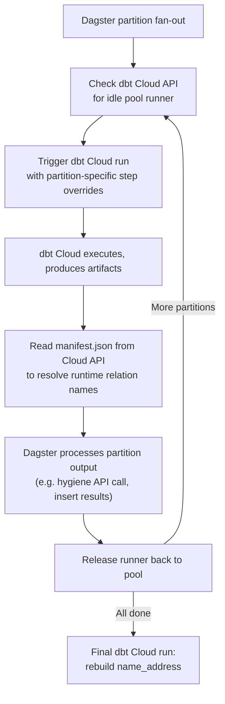

## Dagster + dbt Cloud: Partition Fan-Out Without Rebuilding the Wheel

### The Situation

You are using Dagster+ to orchestrate dbt-core for partition-based processing — running the same transformation logic across multiple file partitions (001, 002, 003, ...) in a single Snowflake instance. This works today for execution. The question is what you're giving up by bypassing dbt Cloud.

This memo walks through the gap honestly — what dbt Cloud provides as product that you'd otherwise need to build and maintain as custom engineering — and shows how the two tools work together without replacing either one.

### What Stays the Same

- **Dagster+ remains the orchestrator.** Partition fan-out, dependency graphs, retries, concurrency limits, and cross-system coordination are all still Dagster's job. Nothing about your Dagster investment changes.
- **Your dbt models are unchanged.** The same `file_orders_stage`, `file_orders_refined`, `file_orders_rejects`, `hygiene_results`, and `name_address` models run exactly as they do today. The SQL doesn't move.
- **Snowflake is still the warehouse.** No data movement, no new compute layer.

### What You're Leaving on the Table

Running dbt-core from Dagster works for execution. But execution is only one part of operating dbt in production. By bypassing dbt Cloud, you opt out of its development and deployment lifecycle — and that lifecycle is where most of the operational risk lives.

Here's what that looks like in practice:

| Capability | dbt Cloud | Dagster+ with dbt-core |
|---|---|---|
| **PR-based CI** | Configure a CI job. Auto-creates a temp schema per PR (`dbt_cloud_pr_<job_id>_<pr_id>`), builds only modified models + downstream, runs all dbt tests, posts pass/fail to your PR. Temp schema auto-deleted on merge. | Write ~200 lines of Python: Snowflake clone/drop ops, environment-aware I/O managers, graph-to-job wiring. Manually edit GitHub Actions or GitLab CI workflows. Maintain the clone lifecycle yourself. |
| **Schema change detection** | Advanced CI compares PR results vs. production — row counts, column changes, primary key diffs — and posts a summary directly to the PR. | Build it yourself or go without. |
| **Stale run cancellation** | New commits to a PR automatically cancel in-flight CI runs. | Implement your own cancellation logic. |
| **CI run isolation** | CI runs don't consume production run slots. Different PRs run concurrently. | Shared infrastructure unless you configure separate executors. |
| **SQL linting** | SQLFluff built into CI jobs. | Self-managed linting step in your CI pipeline. |
| **Docs** | Auto-generated, hosted, versioned documentation site. | `dbt docs generate` + host and maintain it yourself. |
| **Source freshness** | Scheduled freshness checks with built-in alerting. | Custom Dagster sensor. |
| **Environment promotion** | First-class dev/staging/prod environments — separate credentials, target schemas, and dbt versions per environment. Promoting a change means merging a branch. | `profiles.yml` + environment variables + CI scripts. Works until someone fat-fingers a prod schema name in a staging deploy. |
| **Run audit trail** | Every run is a first-class object with its own URL, step logs, timing, and artifacts. Platform teams can inspect without Dagster access. | Dagster run logs only. No dbt-specific audit trail visible to non-Dagster users. |

The key point: **dbt Cloud gives you a production-grade CI/CD and governance workflow out of the box.** The Dagster+ path requires you to build and maintain that workflow. This isn't about which tool is better in the abstract — it's about which path gets you to safe, tested deployments with the least custom engineering.

### What Changes

Instead of Dagster spawning a `dbt build` subprocess, it triggers a **dbt Cloud job** via API and polls for completion. A small pool of pre-configured Cloud jobs (`partition_runner_01` through `partition_runner_05`) handles concurrent partitions. Dagster's built-in concurrency controls cap parallelism to match the pool size, and the dbt Cloud API is the only external dependency — no additional coordination infrastructure required.



The integration pattern keeps Dagster doing what it's good at (orchestration, fan-out, cross-system coordination) while dbt Cloud handles what it's good at (execution, governance, CI/CD, environment management).

### The Integration Pattern

**Artifact-driven relation resolution** is the most technically interesting part. After a dbt Cloud run completes, Dagster reads `manifest.json` from the Cloud API to discover the *exact* relation names (database, schema, table) that dbt materialized. Downstream steps — like the hygiene API call that needs to `SELECT * FROM table(address_hygiene_pending(...))` — use these resolved names instead of constructing them from convention. This means Dagster code is environment-agnostic: it works the same in dev and prod without conditional logic or variable swapping.

**Credential separation** — dbt Cloud execution credentials live in dbt Cloud's environment configuration, and the job-pool resource in Dagster holds only a dbt Cloud API token for trigger/artifact APIs. Dagster still uses Snowflake credentials for the hygiene processing step that directly reads/writes warehouse tables. This keeps run orchestration isolated from warehouse execution credentials while preserving the existing downstream processing behavior.

### Honest Tradeoffs

**The pool pattern adds machinery.** The `DbtCloudJobPool` resource handles pool discovery, triggering, polling, and artifact resolution. Running `dbt build` as a subprocess is mechanically simpler. The complexity here buys you the governance and CI/CD story above, not simplicity.

**dbt Cloud does not natively support partition fan-out.** This pool pattern is a purpose-built integration. It works, and it's reusable across projects, but it's not a product feature. When dbt Cloud ships infinitely-triggerable ephemeral jobs, the pool machinery goes away and the pattern simplifies to "trigger and poll."

### What It Takes to Adopt

| Component | Description |
|---|---|
| **dbt Cloud job pool** | 5 identically-configured jobs (`partition_runner_01`-`05`), managed as code via `dbt-jobs-as-code` |
| **Dagster resource** | `DbtCloudJobPool` — handles pool discovery, triggering, polling, and artifact resolution. Coordinates via the dbt Cloud API only — no additional infrastructure. |
| **Secrets** | A single dbt Cloud API token. In Dagster+: stored as a deployment secret. No warehouse credentials needed in the orchestration layer. |

### Common Questions

**"Can't we just set up CI ourselves in GitHub Actions?"**
You can. It's `dbt build --select state:modified+` in a workflow, plus temp schema creation, cleanup scripts, and PR status posting. Doable, but it's undifferentiated engineering — and ongoing maintenance — for a capability that dbt Cloud provides as product.

**"What about the dagster-dbt integration?"**
The `dagster-dbt` package is great for representing dbt models as Dagster assets, giving you lineage visibility and cross-system dependency management. It is not a replacement for dbt Cloud's CI/CD, environment management, or governance features. They are complementary: `dagster-dbt` for lineage, dbt Cloud for lifecycle.

**"Why not just keep running dbt-core from Dagster?"**
You can. The cost is that you take on responsibility for CI/CD, testing, environment promotion, docs hosting, credential management, and audit trail — all things dbt Cloud provides out of the box. For a team standing up CI/CD for the first time, that's a significant amount of custom engineering and operational surface area that isn't core to the business.

**"Is the pool pattern too custom?"**
It's a single Dagster resource plus project-specific step overrides. The resource is reusable across projects. The project-specific piece is just the `steps_override` list — what dbt commands to run per partition.

**"Does this work in Dagster+?"**
Yes. The code is identical. Only the config source changes: Dagster+ deployment variables and secrets instead of a local `.env` file.

**"What happens if dbt Cloud ships native partition/trigger support?"**
The pool machinery goes away. The core pattern — Dagster orchestrates, dbt Cloud executes, artifacts drive downstream logic — stays exactly the same.

### Demo Commands

```bash
# Sync the dbt Cloud job pool definitions
dbt-jobs-as-code plan --project-id 489484 dbt_cloud_jobs/jobs.yml
dbt-jobs-as-code sync --project-id 489484 dbt_cloud_jobs/jobs.yml

# Start the Dagster dev server
cd dagster_partition_demo
uv sync
uv run --active dagster dev
```

