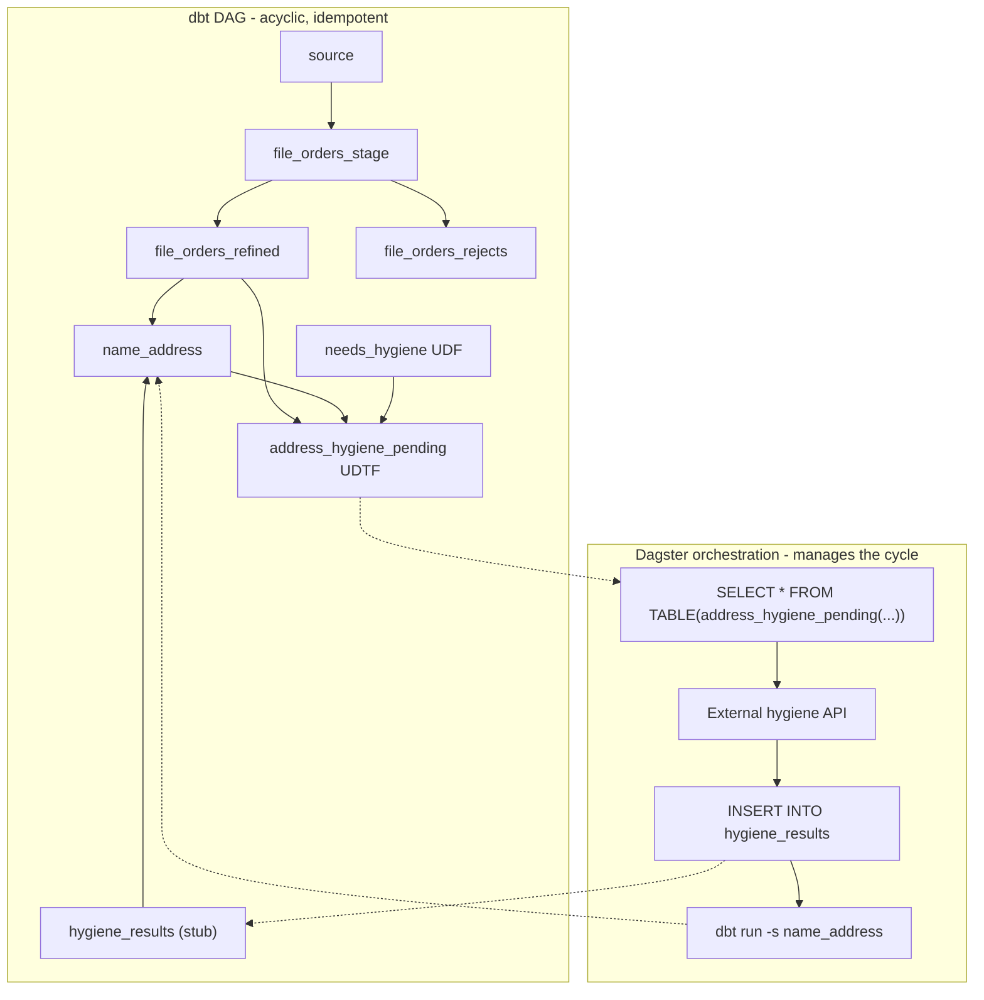

# Hygiene overlay: UDTF-based routing

This doc describes the partition_demo pipeline as two layers: an **idempotent dbt end-to-end path** and an optional **hygiene process overlay** that routes records to an external hygiene service and merges results back into `name_address`. Routing logic lives in dbt-managed UDFs/UDTFs; the non-idempotent cycle is managed by Dagster.

## Architecture



- **Solid arrows (dbt DAG)**: `dbt build -s +address_hygiene_pending` runs source → staging → refined/rejects → hygiene_results (stub) → name_address, then creates the UDFs/UDTF. Safe to run anytime; no hygiene step required.
- **Dashed arrows (Dagster overlay)**: Dagster queries the UDTF, calls the external API, INSERTs results into `hygiene_results` (a dbt-managed table), then re-runs `name_address` to merge. The cycle exists only in Dagster orchestration, not in the dbt DAG.
- **`hygiene_results`** is an append-only incremental stub — dbt creates the table on first build, Dagster INSERTs raw API responses with an `inserted_at` timestamp. The append strategy means no merge overhead and no contention on concurrent writes. `name_address` deduplicates to the latest result per customer using `inserted_at` and uses it as a high-water mark for incremental filtering.

## dbt functions

### `needs_hygiene` (scalar UDF)

Shared staleness predicate: returns TRUE if a record should be routed to hygiene — either never hygiene'd (NULL date) or stale beyond the threshold. Used internally by `address_hygiene_pending` and available as a general-purpose warehouse function.

```sql
SELECT needs_hygiene(NULL, 18);          -- TRUE  (never hygiene'd)
SELECT needs_hygiene('2024-01-15', 18);  -- TRUE  (stale)
SELECT needs_hygiene(CURRENT_DATE(), 18); -- FALSE (fresh)
```


| Argument            | Type      | Default | Purpose                                          |
| ------------------- | --------- | ------- | ------------------------------------------------ |
| `last_hygiene_date` | `DATE`    | —       | Date the record was last sent through hygiene.   |
| `staleness_months`  | `INTEGER` | `18`    | Months after which a record is considered stale. |


### `address_hygiene_pending` (UDTF)

Returns records that should be sent to address hygiene. Captures both cases through a single interface:

- **New addresses** (never seen in `name_address`) — typically ~5-10% of records on any given file run.
- **Stale addresses** (last hygiene'd beyond the threshold) — during normal file processing the default 18-month window won't match, so only new records are returned. For periodic refresh runs, lower the threshold to pick up stale records.

Both parameters are optional, making the UDTF reusable across per-file jobs running in parallel and cross-file periodic refreshes.

```sql
-- Per-file run: new addresses for this file (parallel-safe across partitions)
SELECT * FROM TABLE(address_hygiene_pending('file_001'));

-- Periodic refresh: stale records across ALL files
SELECT * FROM TABLE(address_hygiene_pending(NULL, 12));

-- Both: new + stale for a specific file
SELECT * FROM TABLE(address_hygiene_pending('file_001', 12));
```

| Argument             | Type      | Default | Purpose                                                         |
| -------------------- | --------- | ------- | --------------------------------------------------------------- |
| `p_file_id`          | `VARCHAR` | `NULL`  | File/partition identifier. NULL returns records across all files.|
| `p_staleness_months` | `INTEGER` | `18`    | Passed through to the `needs_hygiene` predicate.                |


Returns: `table(customer_id VARCHAR, order_id VARCHAR, store_id VARCHAR, file_id VARCHAR)`

## Commands

### Base (idempotent E2E)

Run the full dbt path including function creation. Works with or without any hygiene run.

```bash
dbtf build -s +address_hygiene_pending --vars '{"partition_id": "YOUR_FILE_ID"}'
```

This builds: source → staging → refined/rejects → name_address → needs_hygiene UDF → address_hygiene_pending UDTF.

To run just the model path (without recreating functions):

```bash
dbt build -s +name_address --vars '{"partition_id": "YOUR_FILE_ID"}'
```

### Hygiene overlay (Dagster orchestration)

When you want to send records to the external hygiene service:

1. **Build the idempotent path + UDTF**:
  ```bash
   dbt build -s +address_hygiene_pending --vars '{"partition_id": "YOUR_FILE_ID"}'
  ```
2. **Query the UDTF** — Dagster reads pending records directly from the warehouse:
  ```sql
   SELECT * FROM TABLE(address_hygiene_pending('YOUR_FILE_ID'))
   -- periodic refresh across all files:
   SELECT * FROM TABLE(address_hygiene_pending(NULL, 12))
  ```
   If row count is 0, no hygiene is needed — skip to step 5 or stop.
3. **Hygiene process** — Dagster calls the external hygiene API with the pending records. Results are written to the `hygiene_results` source table. This step is outside the dbt DAG.
4. **Merge results** — re-run name_address to pick up new hygiene results:
  ```bash
   dbt run -s name_address
  ```
5. **(Optional) Full rebuild** — or run the complete build again:
  ```bash
   dbt build -s +name_address --vars '{"partition_id": "YOUR_FILE_ID"}'
  ```

## Hygiene step (placeholder)

The hygiene box in the diagram is intentionally a placeholder:

- **Input**: Rows returned by the `address_hygiene_pending` UDTF.
- **Output**: Rows INSERTed into `hygiene_results` (a dbt-managed incremental model stub).
- **Orchestration**: Dagster calls the external hygiene API and writes results; this step is not part of the dbt DAG.

Once the customer's hygiene models and API contract are known, this section can be updated with concrete steps and ownership.

### `hygiene_results` model stub

`hygiene_results` is an append-only incremental model. On first `dbt build` it creates an empty table with the correct schema. Dagster INSERTs raw API responses directly into this table, including a `CURRENT_TIMESTAMP()` value for the `inserted_at` column. The append-only strategy means:

- Parallel partition jobs can INSERT simultaneously — no unique-key contention.
- Multiple rows per `customer_id` are expected (re-hygiene'd records, overlapping partitions).
- `name_address` deduplicates to the latest result per customer via `QUALIFY ROW_NUMBER() ... ORDER BY inserted_at DESC`.
- `name_address` uses `inserted_at` as a high-water mark: on incremental runs it only scans hygiene results newer than the last run.
- `name_address` uses `ref('hygiene_results')` — standard dbt dependency, no `adapter.get_relation()` guard needed.

## Adding another overlay

To add a new hygiene overlay (e.g., email hygiene):

1. **New UDTF**: Create `functions/email_hygiene_pending.sql` — same shape as `address_hygiene_pending.sql` with different refs and columns.
2. **New YAML entry**: Add the function definition to `functions/schema.yml`.
3. **New stub model**: Create `models/partition_demo/email_hygiene_results.sql` — same shape as `hygiene_results.sql` with the overlay's columns.
4. **New terminal model**: Create `models/partition_demo/email_address.sql` — the merge model (equivalent of `name_address.sql`), refs the stub.
5. **YAML entries**: Add model definitions to `_partition_demo.yml`.

The `needs_hygiene` scalar UDF is shared across all overlays — no duplication of the staleness logic.

## Batch table (optional)

If Dagster needs a persisted batch table (for audit trail or API input format), the `build_hygiene_batch` macro can materialize the UDTF output:

```bash
dbt run-operation build_hygiene_batch \
  --args '{"batch_identifier": "pre_match_hygiene_batch", "batch_schema": "partition_demo", "udtf_call": "TABLE(address_hygiene_pending('"'"'YOUR_FILE_ID'"'"'))"}'
```

This is optional — the recommended path is for Dagster to query the UDTF directly.

## Developer testing

- **Build everything**: `dbt build --select +address_hygiene_pending --vars '{"partition_id": "001"}'`
- **Query pending records**: `SELECT * FROM TABLE(address_hygiene_pending('001'))` in a SQL client.
- **Unit test the UDF**: Add unit tests in `functions/schema.yml` to validate `needs_hygiene` edge cases.
- **Simulate hygiene**: Insert rows into `hygiene_results`, then `dbt run -s name_address` and `dbt test -s name_address`.

